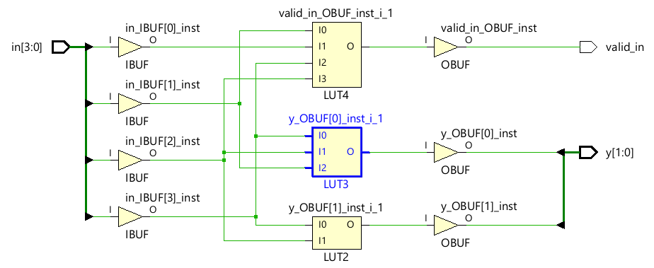

## Overview

인코더는 디코더와 반대로 n개의 입력을 받아 m개의 출력에 이진코드로 반영하는 모듈이다.

인코더에서 고려해야 할 점은 원하는 입력값보다 실제로 들어올 수 있는 입력값이 많다는 점이다.
따라서 우선순위 인코더(priority encoder)가 있다.

priority encoder의 경우 가장 큰 1 = leading 1 = most significant 1 비트의 위치가 이진코드로 생성된다.


인코더도 디코더와 마찬가지로 Combinational Logic Module이므로 dataflow, behavioral 로직을 모두 사용가능하다.

디코더의 경우 shift 연산을 통해 간결하게 구현이 되었는데 인코더도 살펴보도록 하자.

## Design

디코더는 shift 연산을 통해 assignment 한 줄로 구현이 거의 완료되고 쉽게 configurable한 형태의 코드를 짤 수 있었다.

인코더의 경우 어떤 식의 구현이 좋은지 감이 잘 안와서 [예제](https://ocw.snu.ac.kr/sites/default/files/NOTE/5535.pdf)를 좀 찾아봤다.

먼저 if else 형식으로 구성하면 아래와 같은 형태가 된다.

```verilog
// a 4-to-2 priority encoder using if ... else structure
module priority_encoder_4to2_ifelse 
    (
    input [3: 0] in,
    output valid_in,
    output reg[1: 0] y
    );
// the body of the 4-to-2 priority encoder
assign valid_in = |in;
always @(in) begin
if (in[3]) y = 3; else // MSB: higher priority
if (in[2]) y = 2; else
if (in[1]) y = 1; else
if (in[0]) y = 0; else
y = 2'bx;
end
endmodule
```

비교적 쉽게 생각할 수 있는 if else 형식이다.
Schematic을 살펴보면 아래와 같은데,



여기서 3-1 LUT가 y[0], 2-1 LUT가 y[1]로 연결된다.
직접 truth table을 살펴보면


```
y[1] = in[3] | in[2]
y[0] = in[3] | (!in[1] & in[2])
```
로 합성된 것을 볼 수 있다.

정확한 규칙을 알 수는 없지만, if else문을 생각이상으로 잘 해석한다는 점을 느꼈다.

여기서 특히 중요한 점은 else문을 통해 예외케이스에 대한 처리를 해주는 것이다.

reg 변수는 합성과정에서 실제 저장소(latch)로 생성되기도 하고, 아닐 수도 있는데 예외케이스를 제대로 처리하지 않으면 Combinational Logic을 설계했음에도 latch가 만들어질 수도 있기 때문이다.

다음은 case를 이용한 처리이다.

참고로
casex는 x, z를 don't care로 처리해 비교하고 casez는 z(?)를 don't care로 처리해 비교한다.

따라서 casez에서 x는 unknown로 직접 비교하기 때문에 조금 더 엄격한 비교를 수행한다.

```verilog
// a 4-to-2 priority encoder using case structure
module priority_encoder_4to2_case(in, valid_in, y);
input [3:0] in;
output reg [1:0] y;
output valid_in;
// the body of the 4-to-2 priority encoder
assign valid_in = |in;
always @(in) casex (in)
4'b1xxx: y = 3;
4'b01xx: y = 2;
4'b001x: y = 1;
4'b0001: y = 0;
default: y = 2'bx;
endcase
endmodule
```

여기서 casex의 위험성을 배울 수 있었는데,
만약 in = 4'zzzz일 경우 의도로는 2'bx가 출력되어야 하지만, 첫번째 조건문과 매칭되어버린단 것이다.

```verilog
module tb_encoder(

    );
    
    reg [3: 0] in;
    wire valid_in;
    wire [1: 0] y;
    
    priority_encoder_4to2_case tb(in, valid_in, y);
    
    initial begin
        in = 0;
        
        #10 in = 4'bzzzz;
    end
    
endmodule
```


이것은 일반적인 상황에서 의도치않은 동작이 되어버린다.
물론 시뮬레이션이기 때문에 합성 결과와는 조금 부합하지 않는 부분도 있다.

Schematic은 if else와 완전히 똑같은 결과가 나온다.


```verilog
// an m-to-n priority encoder
module priencoder_m2n(x, valid_in, y);
parameter m = 8; // define the number of inputs
parameter n = 3; // define the number of outputs
input [m-1:0] x;
output valid_in; // indicates the data input x is valid.
output reg [n-1:0] y;
integer i;
// the body of the m-to-n priority encoder
assign valid_in = |x;
always @(*) begin: check_for_1
for (i = m - 1 ; i > 0 ; i = i - 1)
if (x[i] == 1) begin y = i; disable check_for_1; end
else y = 0; // Why need else …?
end
endmodule
```

이번엔 드디어 parameterized로 우선순위 인코더를 구현한 코드이다.
for문과 disable을 이용하여 구현하는데, break 문법이 지원되는 환경이라면 break 문법도 상관 없다.

Schematic은 역시 동일하게 합성된다.


```verilog
// an m-to-n priority encoder
module priencoder_m2n_while(x, valid_in, y);
parameter m = 4; // define the number of inputs
parameter n = 2; // define the number of outputs
input [m-1:0] x;
output valid_in; // indicates the data input x is valid.
output reg [n-1:0] y;
integer i;
// the body of the m-to-n priority encoder
assign valid_in = |x;
always @(*) begin
i = m - 1 ;
while(x[i] == 0 && i >= 0 ) i = i - 1;
y = i;
end
endmodule
```

마지막으로 while문을 이용한 구현이다.
Schematic은 어차피 똑같을 것 같아서 보지 않았다.

4가지 버전의 encoder를 확인했는데, verilog 문법이 생각보다도 더! 잘 지원된다는 걸 깨달았다.

미천한 판단으로 많은 문법이 합성에선 사용못하지 않을까 생각하거나, 비효율적 합성으로 이어질 것이라 생각했다.

물론 많은 코드를 본 것은 아니지만, for문 while문 case문 등 기능이 의도대로 잘 합성되고 서로 차이도 나타나지 않는 것을 보고 컴파일러가 생각보다 더 똑똑하다는 느낌도 받았다.

개인적으로 casez, casex는 아직 조금 헷갈리는데 일단 시뮬레이션 단계에서 차이가 나오는 거라고 이해하고 합성단계에선 don't care에 대해 동일하게 결과가 나오는 것 같다.