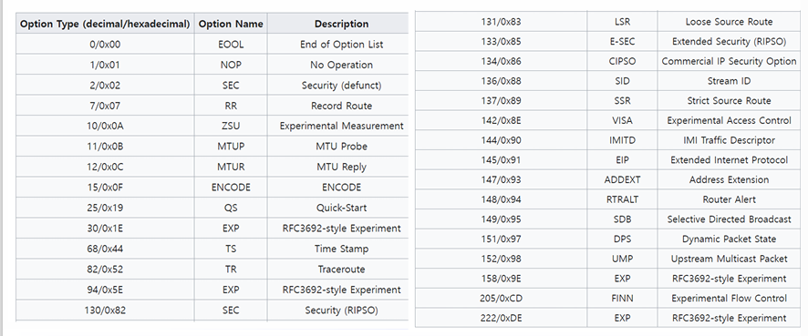

## IPv4

IPv4(Internet Protocol v4)는 network layer의 프로토콜로 인터넷의 동작에 있어 가장 핵심적 프로토콜이다. 
요약하면 전 세계에 서로 분리된 네트워크들을 서로 논리적으로 연결하고, IP 주소를 통해 각 노드가 서로를 식별할 수 있도록 한다.
IPv4는 다음과 같은 특성을 가진다.


- Unreliable
  Best effort service
  가능한 범위 내에서 패킷을 전송하기 위해 최선을 다한다. 따라서 반드시 패킷이 전송됨을 보장하진 않는다.

- Connectionless
  connection의 수립 없이 패킷을 전송한다.
  따라서 패킷들은 각각 서로 다른 경로로 전송될 수 있고, 그 순서도 바뀔 수 있다.

- Address Assignment
  IP 주소를 통해 각 노드를 고유하게 식별한다.

- Routing
  목적지 IP 주소에 따라 패킷이 전송될 경로를  결정한다.

## IPv4 Header


IP 패킷은 헤더(>=20 bytes)와 데이타 섹션으로 분리된다.

신뢰성 있는 데이터 전송을 목적으로 하지 않기 때문에 헤더에 대해서만 checksum을 계산한다.

대신 하위의 data link layer에서 CRC footer를 통해 에러를 검출하며,
심지어 상위의 transport layer에서도 TCP의 경우 직접 error check를 수행하기 때문에 큰 걱정할 필요가 없다.


IPv4 헤더는 필수 13필드, 옵션을 포함해 14필드로 구성된다.

```c++

struct IPv4Header {
    /**
     * IP의 버전을 명시합니다.
     * IPv4의 경우 0x4로 고정입니다.
     */ 
    byte version : 4;

    /**
     * 헤더의 길이를 정의합니다.
     * 헤더의 길이는 반드시 4bytes aligned이기 때문에
     * 이 필드는 헤더가 32-bits word 몇 개로 이루어졌는지 명시합니다.
     * 헤더의 최소 길이는 20byte이므로 header_length >= 5이고
     * optional header에 의해 최대 15 * 32 bits = 480 bits = 60 bytes까지 헤더가 늘어날 수 있습니다.
     */
    byte header_length : 4;
    
    /**
     * 서비스의 유형을 명시합니다. ex) VoIP
     */
    byte service_type;
    
    /**
     * 전체 패킷의 길이를 명시합니다.
     * 20bytes ~ 2^16 - 1 = 65535 bytes.
     * 호스트 머신 뿐만 아니라 라우터에 의해서도
     * 패킷 사이즈에 제한이 있을 수 있습니다.
     * 패킷 사이즈에 제한이 생기면 해당 노드는
     * 패킷을 쪼개서 보내게 됩니다.
     */
    byte total_length[2];

    /**
     * 서로 쪼개진 패킷들이 원래 어떤 패킷의 소유였는지 식별하기 위해 사용합니다.
     */
    byte identification[2];
    
    #define DF (1 << 1)
    #define MF (1 << 2)
    /**
     * bit 0: reserved
     * bit 1: don't fragment(DF)
     * bit 2: more fragment(MF)
     * 
     * 만약 DF가 set일 경우, fragmentation이 필요하면 라우터는 전체 패킷을 drop합니다.
     * 목적지 호스트가 패킷을 다시 재조합할 수 없는 경우 사용합니다.
     * MTU(Maximum Transfer Unit)을 추적하기 위해 사용되기도 합니다.
     * 
     * MF는 fragmented된 패킷들을 식별하기 위해 사용합니다.
     * 
     * 만약 어떤 원본 패킷이 라우터를 거치며 여러 조각들로 쪼개졌을 때,
     * 마지막 패킷을 제외한 모든 패킷은 MF=1입니다.
     * 
     * 마지막 패킷의 경우 non-zero fragment offset field를 통해 쪼개지지 않은 패킷들과 구별됩니다.
     */
    byte flags : 3;

    /**
     * 13 bits length.
     * 
     * fragment 패킷의 위치를 식별합니다.
     * 0 ~ 2^13 - 1 = 8191.
     * fragment는 8bytes 단위로 수행됩니다.
     * 따라서 fragment length * 8bytes = offset
     * 그러므로 maxinum offset은 (2^13 - 1) * 8 = 65528 bytes이고, 헤더 길이 20bytes를 포함하면 65528 + 20 = 65548 bytes가 됩니다.
     * IP의 최대 길이는 65535 bytes이므로 fragmentation을 진행할 시 IP의 max length를 초과할 수 있음을 알 수 있습니다.
     */
    byte fragment_offset[2] :  13;

    /**
     * datagram의 lifetime을 명시하여
     * 네트워크 상에서 라우팅을 무한반복하는 것을 예방합니다.
     * 초(sec) 단위로 명세되었으나, 실제로는 홉(hop)의 최대 count로 작동합니다. 매 라우터에 도착할 때마다, 라우터는 패킷의 ttl을 1씩 감소시킵니다.
     * 만약 ttl = 0이 될 경우 패킷을 버리고
     * 경우에 따라 ICMP time exceeded message를 sender에게 보냅니다.
     */
    byte ttl;

    /**
     * IP datagram이 담고 있는 데이터의 프로토콜을 명시합니다.
     * 반드시 상위계층의 프로토콜을 의미하진 않습니다.
     * 
     * ex) ICMP(1), TCP(6), UDP(17)
     */
    byte protocol;

    /**
     * header의 에러 체크를 위해 사용합니다.
     * 패킷이 라우터에 도착하면,
     * 라우터는 헤더를 보고 체크섬을 계산한 뒤,
     * 이 필드의 값과 비교합니다.
     * 만약 일치하지 않는 경우 패킷을 버립니다.
     * 
     * 또한 패킷이 라우터에 도착하면, ttl값이 변하기 때문에 checksum도 매 홉마다 새로 계산됩니다.
     */
    byte header_checksum[2];

    /**
     * 각각 sender와 receiver의 IPv4 주소를 명시합니다.
     * NAT에 의해 수정될 수 있습니다.
     */
    byte source_address[4];
    byte destination_address[4];

    /**
     * IP options 헤더를 담고 있습니다.
     */
    struct {
      /**
       * 만약 모든 fragment 패킷에
       * 옵셔널 헤더가 포함되어야 할 때
       * 설정합니다.
       */
      byte copied : 1;

      /**
       * 옵션의 카테고리를 명시합니다.
       * 0: control
       * 2: debugging and measurement
       */
      byte option_class : 2;

      /**
       * 구체적 옵션을 명시합니다.
       */
      byte option_number : 5;

      /**
       * 현재 필드를 포함해 전체 옵션의
       * 길이를 명시합니다.
       */
      byte option_length;

      /**
       * 옵션 데이터입니다.
       * Maximum Option Header Length = 40 bytes
       */
      byte option_data[36]
    } 
}
```


옵션의 타입은 옵션 헤더의 첫 8bit 필드에 의해 결정되며 구체적 종류는 아래와 같다.
