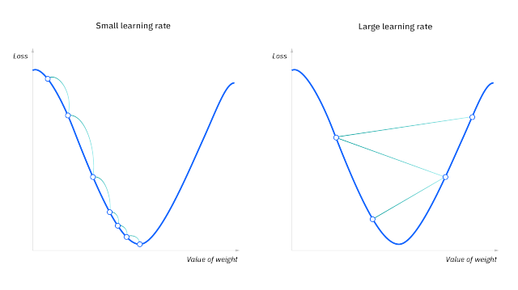
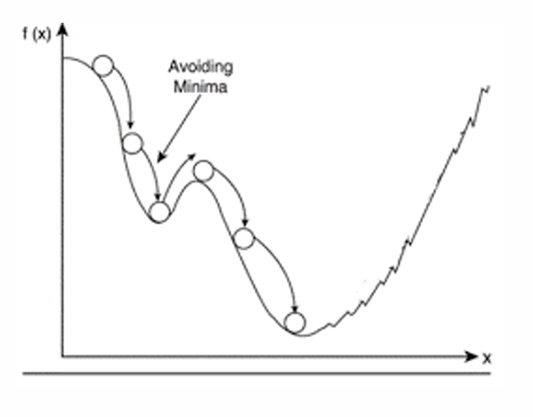
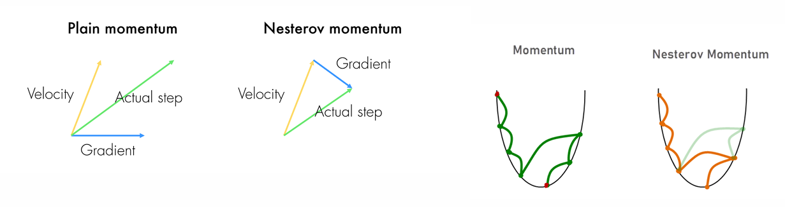

## 최적화 기법

기계학습에선 Loss function이 최소값이 되는 점을 찾기 위해 다양한 최적화 기법을 사용한다.
오늘은 기법들이 어떻게 나왔는지 대략적으로 살피고 어떤 흐름으로 발전하는지 알아보도록 할 것이다.

## Gradient Descent

먼저 우리가 해결하고자 하는 문제는 다음과 같다.

$$
\begin{align}
W = \underset{W} {\text{minimize}} L(W)
\end{align}
$$

즉, 주어진 손실함수 $L$을 최소화할 수 있는 가중치 $W$를 찾는 것이 최적화 문제이다.

이제 첫 번째로 경사하강법(Gradient descent)를 살펴보자.

$$
\begin{align}

&W_{t+1} := W_t - \lambda \nabla L = W_t - \frac{\lambda}{N_{input}} \sum_{i \in input} \nabla L_i
\end{align}
$$

경사하강법은 미분의 기본적 성질을 이용한다.

고등학교 시절부터 배워온 미분의 기능 중 하나는 함수의 증감 여부 파악과 극대/극소값 판정이다.

경사하강법은 이러한 성질을 이용해 손실함수 $L$가 최소가 되는 가중치를 찾는 전략을 취한다.

학습률 $\lambda$은 매번 가중치를 얼만큼 업데이트할 지를 결정하는데, 너무 작거나 너무 클 경우
아래와 같이 비효율적 학습을 하게 되고, 오른쪽 그림과 같이 심지언 기존보다 손실함수값이 증가할 수도 있다.

단조감소하는 적절한 학습률을 결정하는 것이 경사하강법의 가장 중요한 문제라 할 수 있다.

## Stochastic Gradient Descent(SGD)

Gradient Descent는 손실함수를 최적화하는 것에 있어 직관적 알고리즘을 제공한다.
그러나 (2)를 다시 살펴보면, 손실함수의 변화율을 계산하는 부분에서 모든 input 데이터를 사용해 평균값을 내는 것을 확인할 수 있다.

이론적으론 문제가 없지만, 실제론 모두 컴퓨터를 통해 계산하기 때문에 한 번의 가중치 업데이트를 위해서 오랜 시간이 걸리고, 또 가중치 업데이트가 느려져 전체 학습시간이 증가하는 문제가 있다.

이에 등장한 대안이 Stochastic Gradient Descent이다.
SGD의 기본적 아이디어는 한 번의 업데이트에 랜덤한 하나의 샘플만을 이용하자는 것이다.

$$
\begin{align}
\begin{split}
&W_{t+1} := W_t - \lambda \nabla L = W_t - \lambda \nabla L_i, \quad i \in Input
\end{split}
\end{align}
$$

## Mini-Batch Gradient Descent

SGD에선 매번 하나의 샘플을 보는 것과 GD에서 전체 샘플을 보는 것에 절충안으로 일명 "mini-batch"가 등장한다.

매 스탭마다 전체 샘플의 subset을 참고하겠다는 것이다.

$$
\begin{align}
\begin{split}
&Given \quad U \subset Input,\\
&W_{t+1} := W_t - \lambda \nabla L = W_t - \frac{\lambda}{N_u} \sum_{i \in U} \nabla L_i
\end{split}
\end{align}
$$

## Momentum

기존의 GD, SGD, mini-batchGD는 모두 Gradient 연산을 통해 최적값을 찾는다는 전략을 취했다.

그러나 이 알고리즘이 반드시 최솟값을 찾는다고 보장할 수는 없는데,

그 원인 중 하나는 최소값(Global Minimum)을 찾아내는 것이 아닌 극소값(Local Minima)을 찾아버리는 것이다.

Momentum은 이러한 문제를 해결하기 위해
물리적 운동에서 흔히 관찰되는 "관성"의 개념을 도입한다.

$$
\begin{align}
\begin{split}
\Delta W_t &= \alpha * \Delta W_{t-1} + \lambda \nabla L\\
W_t &= W_{t-1} + \Delta W_{t-1}
\end{split}
\end{align}
$$

여기서 $\Delta W_t$는 일종의 진행 속도 $v$로 생각할 수 있다.
그리고 $\lambda \nabla L$는 가속도 $a$로 생각할 수 있다.

그림을 보면 좀 더 쉽게 이해가 간다.

만약 언덕을 내려오는 공이 있고, 중간에 얕은 구덩이 하나가 있다면?

공은 내려오다가 구덩이에 빠지기도 하지만
이미 붙은 속도(에너지)를 감당하지 못하고 얕은 구덩이를 탈출해 진행해나가게 될 것이다.

실제로 물리학에서 momentum은 운동량이란 말로 정의되는데,

물체의 질량과 속도 벡터를 곱한 것으로 정의한다.

여기서 $\alpha$가 질량, $W_{t-1}$가 이전 속도, $\lambda \nabla L$이 속도변화량 의미함을 직관적으로도 알 수 있을 것이다.

## Nesterov Accelerated Gradient (NAG)

(5)를 다시 살펴보자.
Momentum은 Local minima로의 수렴을 피하기 위한 효과적 관점을 제시하지만, 실제로 운동량이 그러하듯

그 반대 성분의 가속이 일어나기 전까진 계속해서 속도가 커지는 성질이 있다.

이는 학습 과정을 비효율적으로 만들 수 있고, Global Minimum을 지나쳐버릴 수도 있다는 문제가 있다.

이에 Nesterov Accelerated Gradient가 등장하는데,
주요 골자는 미래의 Gradient를 예측하여 미리 속도를 조절한다는 것이다.

$$
\begin{align}
\begin{split}
\Delta W_t &= \alpha \Delta W_{t-1} + \lambda \nabla L(W + \alpha \Delta W_{t-1})\\
W_t &= W_{t-1} + \Delta W_{t-1}
\end{split}
\end{align}
$$

## Adagrad

Momentum을 통해 Local minima로의 수렴을 예방하고 Global minimum을 찾고자 노력했다.

이제 안장점(saddle point)를 피하는 방법을 찾을 것이다.

안장점은 다변수 함수에서, $Gradient=0$이지만,
극소값도, 극대값도 아닌 점을 의미한다.

$$

\begin{align}
\begin{split}
&p \in \R^n \text{ is a saddle point of } f:\R^n \rightarrow \R \iff \\
&\exists v_1, v_2 \in \R^n \quad s.t\\
&g(t) := f(a + tv_1) \text{ has minima at t = 0}\\
&h(t) := f(a + tv_2) \text{ has maxima at t = 0}\\
&
\end{split}
\end{align}
$$

Adagrad는 안장점으로의 수렴을 막기 위해 고안되었는데,

아래와 같이 서술된다.

$$
\begin{align}
\begin{split}
G_t &= G_{t-1} + \Delta L_t\Delta L_t^T\\
&= \sum_i^t \Delta L_i \Delta L_i^T \\
&= (\sum_i^t (\frac{\partial L_i}{\partial w_i})^2)\\
W_t &= W_{t-1} + \alpha \frac{1}{\sqrt{G_{t-1} + \epsilon}} \Delta L_t
\end{split}
\end{align}
$$

여기서 $G_t$는 각 가중치에 대해서 지금까지 변화량의 제곱을 모두 합친 값으로 표현이 되는데,
이는 각 가중치 별로 지금까지 변화한 양의 누적을 반영하고자 하는 의도이다.

만약 안장점에 갖혔다는 것은,
안장점에서 극소점이 되는 방향으로만 가중치들이 변하고 있다는 것을 의미한다.

따라서 $\sqrt{G_{t-1} + \epsilon}$으로 가중치의 변화량을 나누어줌으로써
변화가 적은 가중치 성분에게 더 큰 영향력을 부여한다.

$\epsilon$은 분모가 0이 되는 상황을 예방하기 위함이다.

## RMSprop

Adagrad에서 가중치의 변화 $G_t$는 계속해서 증가한다.

즉, 단조 증가하는 성질이 있다.
$G_t \geq G_{t-1}$

이는 지속적 업데이트 이후 gradient가 0으로 수렴하게 될 것을 의미하는데,

RMSprop은 이것을 decay rate의 도입으로 해결한다.

$$
\begin{align}
\begin{split}
G_t &= \lambda G_{t-1} + (1 - \lambda)\Delta L_t\Delta L_t^T, \quad wheare \space 0 \lt \lambda \lt 1\\
W_t &= W_{t-1} + \alpha \frac{1}{\sqrt{G_{t-1} + \epsilon}} \Delta L_t
\end{split}
\end{align}
$$

decay rate $\lambda$의 도입으로 이전에 변화량은 점진적으로 줄어들고, 가장 최근의 변화량이 가장 큰 영향력으로 작용한다.

## Adam

가장 마지막으로 Adam(Adaptive Moment Estimation)이다.

현재 가장 많이 쓰이는 알고리즘이며, 위의 알고리즘들의 장점을 모두 합치고자 노력한 방법이다.

$$
\begin{align}
\begin{split}
M_t &= \beta_1 M_{t-1} + (1 - \beta_1) \Delta L_t \\
&= (1 - \beta_1) \sum_i^t \beta_1^{t - i} \Delta L_i \\
V_t &= \beta_2 V_{t-1} + (1 - \beta_2) \Delta L_t \Delta L_t^T\\
&= (1 - \beta_2)\sum_i^t \beta_2^{t - i} \Delta L_i \Delta L_i^T\\

\hat{M_t} &= \frac{M_t}{(1 - \beta_1)}\\
\hat{V_t} &= \frac{V_t}{(1-\beta_2)}\\

W_t &= W_{t-1} + \alpha \frac{\hat{M_{t-1}}}{\sqrt{\hat{V_{t-1} + \epsilon}}}
\end{split}
\end{align}
$$

RMSprop과 momentum의 장점을 모두 합치고자 하는 모습이 보인다.

주로 사용되는 hyper-parameter 값은

$$
\epsilon=1^{-8}\\
\beta_1 = 0.9\\
\beta_2 = 0.999
$$
와 같다.

## 출처

- https://arxiv.org/pdf/1412.6980.pdf
- https://en.wikipedia.org/wiki/Gradient_descent
- https://en.wikipedia.org/wiki/Stochastic_gradient_descent
- https://en.wikipedia.org/wiki/Moment_(mathematics)